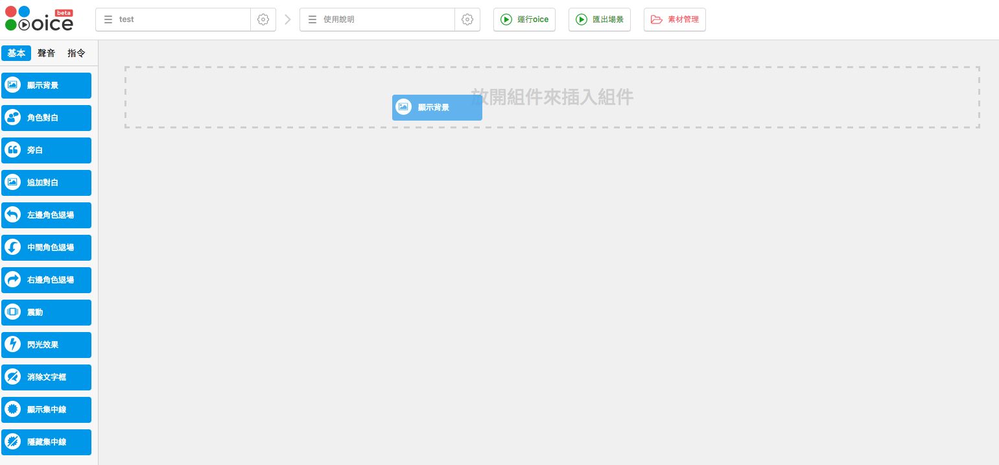
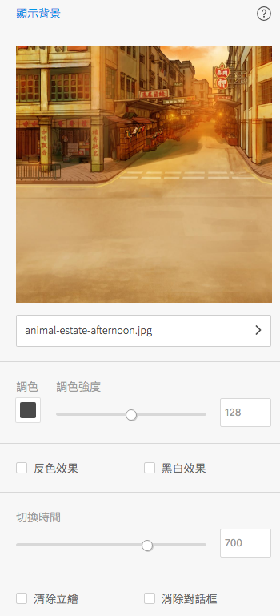
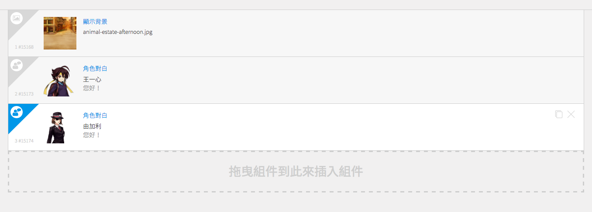
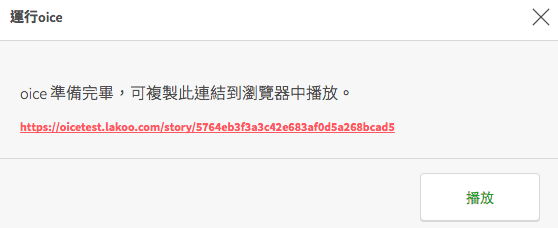

# 使用說明書
> 適用於 v2.0.0

## 步驟一
點擊選擇故事

選擇/新增故事

然後新增一個 oice。可拖動oice調換集數次序

新增後，名稱欄會顯示該 oice 的名稱。

## 步驟二

將想要使用的組件拖至中間的標籤列表。

例如，我將要製作的場景第一幕會出現一個背景，則將顯示背景組件拖至標籤列表第一行，然後放手。

放手後，該組件就會顯示於列表第一行。

## 步驟三
點擊該組件，右側顯示設定欄，可設定該組件內容。
例如，設定背景圖片。

完成該組件設定後，內容將會自動儲存。
然後即可在標籤列表中加入另一組件，以完成整個故事的設定。

## 步驟四
設定好故事組件後，點擊運行遊戲以播放故事。

## 步驟五
點擊鏈接/播放鍵即可播放。

